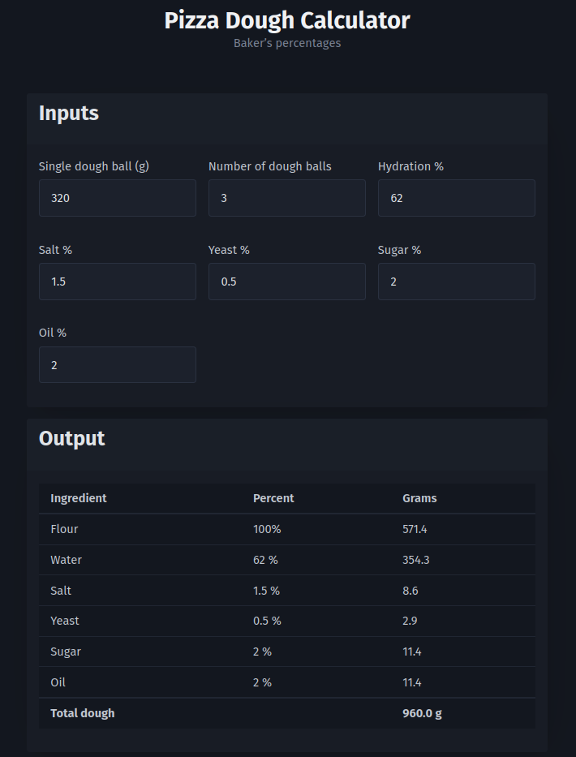

# `pizzadough`

A tiny, single page, live-updating web application that calculates pizza dough recipes using baker's percentages. It is written in [Nim](https://nim-lang.org) using the [Karax](https://github.com/karaxnim/karax/) framework.

## Usage

### Compile

Use Nim's [JavaScript backend](https://nim-lang.org/docs/backends.html#backends-the-javascript-target):

`nim js -d:release -o:main.js main.nim`

### Serve

1. Place `main.js` alongside `index.html`
2. Point your favorite web server at `index.html`

______________________________________________________________________

### Screenshot

